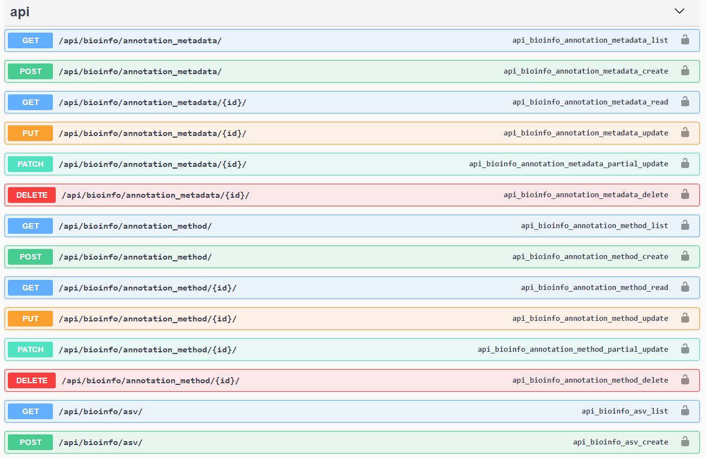
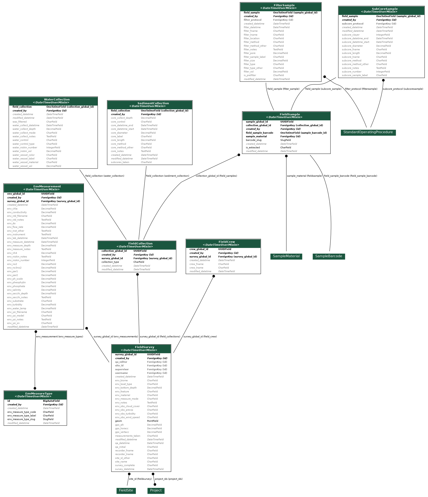
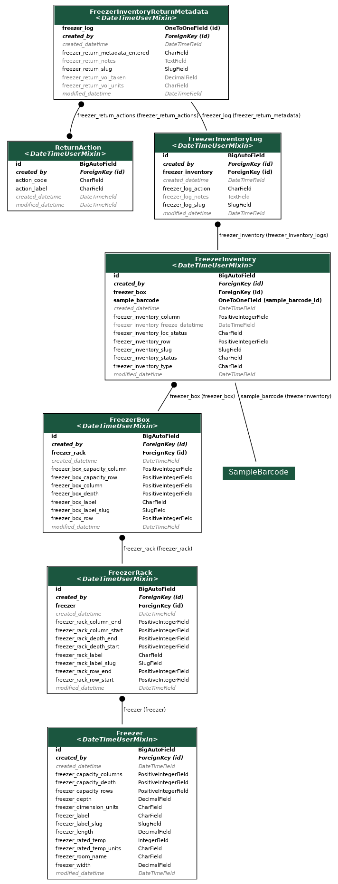
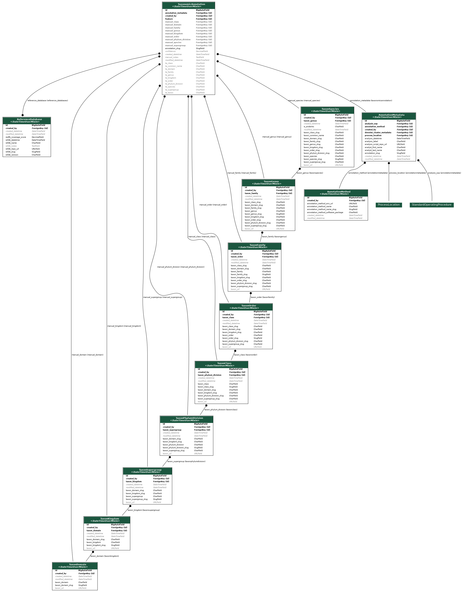

=======================================
Application Programming Interface (API)
=======================================

API Documentation
-----------------

medna-metadata's API was written in the `Django REST Framework <https://www.django-rest-framework.org/>`_ and all API
documentation are automatically generated with `drf-yasg <https://github.com/axnsan12/drf-yasg>`_ library. With an active
deployment, simply navigate to ``https://yourdomain.com/swagger/`` to view details on all Create, Read, Update, and Delete
(CRUD) operations.

Database Design
---------------

.. image:: ../../erds/medna_erd.png
    :width: 400
    :alt: Full medna-metadata entity relationship diagram
    :align: center

Field Data Collection
~~~~~~~~~~~~~~~~~~~~~

Field data collection is project wide, and pertains to environmental and collection information related to sediment or
water samples. These samples are barcoded and that barcode is used as a unique identifier. Barcodes are placed on filters
for water samples, and on sub-cores for sediment samples. Each water collection is filtered using multiple filter types
(Nitex, Glass Fiber Filter, Supor, or Cellulose Nitrate) and each filter represents one sample. If sediment is collected,
it is initially collected as a core. After a core of sediment is collected, it is subdivided into sub-cores,
and each sub-core represents one sample.

Filters, cores, and sub-cores are stored within -80°C lab freezers until extraction.

Wet Lab Processing
~~~~~~~~~~~~~~~~~~

Wet lab processing is conducted by the Wet Laboratory. Wet lab processing pertains to all processing from extraction,
Digital Droplet PCR (ddPCR), quantitative PCR (qPCR), and Next Generation Sequencing (NGS). After filtration or
sub-coring, the samples are extracted. Extraction converts field samples into solutions of eDNA. Extractions share the
same unique barcode identifier as samples.

The tables for LibraryPrep, PooledLibrary, RunPrep, RunResults, and FastqFile are all directly related to Next Generation Sequencing
(NGS) and the generation of FastQ files. FastQ files contain the resulting sequences from NGS, and sequencing is typically
performed by hardware equivalent to an Illumina MiSeq. These NGS tables also relate to information in the IndexPair and
PrimerPair tables. The PCR and PCRReplicate tables pertain to additional analyses that can amplify or quantify eDNA samples
and are also related to the PrimerPair table.

The PrimerPair table contains information related to the target gene, or DNA region of interest. Primers allow for the
amplification of a specific region of DNA, which is important for the positive identification of a particular taxon or
taxonomic group. The IndexPair table contains information related to a unique sequence that is used to identify each
sample. During NGS, the samples are pooled together. Adding a unique index adapter to the sample sequences enables the
separation of pooled samples after sequencing is complete. Separation of pooled samples occurs during a process called
demutiplexing, which converts raw BCL files into two FastQ files for each sample.

Extractions and pooled libraries are stored within the -80°C lab freezers until they are depleted.

Freezer Inventory Tracking
~~~~~~~~~~~~~~~~~~~~~~~~~~

Freezer inventory tracking is conducted by the Wet Laboratory, and pertains to the tracking of all filters, subcores,
extractions, or pooled libraries that may be stored in -80°C lab freezers.

Occasionally a sediment core is not sub-cored within the same day it was collected, so it will be stored in -80°C lab
freezers until it is sub-cored. Water collections will not be stored in -80°C lab freezers, but the filters that are
taken from water are typically stored in freezers until they are extracted.

Extractions are stored within -80°C lab freezers, where they are temporarily removed from the freezer when further
processing is performed. Only small portions are taken from an extraction each time they are removed from the freezer.
After small portions are taken, extractions are placed back in the -80°C lab freezers until there is no more extraction
remaining. The Wet Laboratory will track the amount taken from extractions, who has the extraction, and whether it was
returned to the same freezer location.

A pooled library may also function in a similar way to an extraction, in that it is a solution of eDNA that may be stored
in the -80°C lab freezers. The Wet laboratory will also track the amount taken from a pooled library, who has the
pooled library, and whether it was returned to the same freezer location.

Bioinformatics: Denoising or Clustering
~~~~~~~~~~~~~~~~~~~~~~~~~~~~~~~~~~~~~~~

The bioinformatic process of denoising (converting sequences within FastQ files to Amplicon Sequence Variants) or
clustering (converting sequences within FastQ files to Operational Taxonomic Units), are
represented by the DenoiseClusterMetadata, FeatureReads, and FeatureOutputs tables.

The DenoiseClusterMetadata table covers information related to the specifics of the bioinformatics analysis pipeline.
This table enables users to track the process through which ASVs or OTUs were generated. The resulting
sequences are listed in the FeatureOutput table. The number of reads, or count of each sequence
in each sequencing run, is represented in the FeatureRead table.

Bioinformatics: Taxonomic Annotation
~~~~~~~~~~~~~~~~~~~~~~~~~~~~~~~~~~~~

The bioinformatic process of taxonomic annotation is represented by the AnnotationMetadata, TaxonomicAnnotation,
ReferenceDatabase, TaxonDomain, TaxonKingdom, TaxonClass, TaxonOrder, TaxonFamily, TaxonGenus, and TaxonSpecies tables.

The AnnotationMetadata table covers information related to the specifics of the bioinformatics analysis pipeline. This
table enables us to track the process through which taxonomies are annotated to feature outputs from denoising or
clustering. It is possible that taxonomic annotation may be performed multiple times on the same set of feature outputs.
The TaxonomicAnnotation table retains the results of either BLAST or a trained classifier and also enables the annotation
of manually verified taxonomy. The TaxonDomain, TaxonKingdom, TaxonClass, TaxonOrder, TaxonFamily, TaxonGenus, and
TaxonSpecies tables represent curated regional species lists that can be referenced to manually associate verified
taxonomy to a sequence through the TaxonomicAnnotation table.

